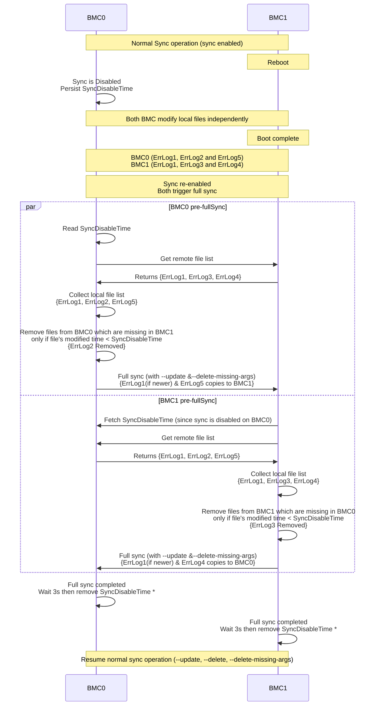

## Full Sync for Bidirectional Sync Paths

When `disable_sync` is set to `true`, both BMCs continue to operate
independently. Data may be:

- **Created** on BMC0 that BMC1 has never seen.
- **Created** on BMC1 that BMC0 has never seen.
- **Deleted** on BMC0 that BMC1 still has.
- **Deleted** on BMC1 that BMC0 still has.

When sync is re-enabled, both BMCs will issue full sync simultaneously to their
sibling. In a normal sync, `--delete` and `--delete-missing-args` are used so
that files deleted on the source side are also removed on the destination,
keeping both sides in sync.

However, for bidirectional paths, `--delete` causes data loss. Since either side
can independently create or delete files during the disabled window, a full sync
operation with `--delete` from BMC0 → BMC1 would:

- Restore files that BMC1 deliberately deleted.
- Delete files that BMC1 newly created.

So `--delete` is omitted for bidirectional full sync. Instead, the steps below
handle deletions explicitly before the full sync operation triggers for the path
configured for bidirectional sync.

`--delete-missing-args` is kept so that if the configured source path for
bidirectional sync does not exist on the local BMC, rsync silently skips it
(returning 0) instead of failing with error code 23 by either removing it from
the destination if present there, or silently ignoring it if absent on both
sides.

This algorithm resolves the state before full sync triggers for the path
configured for bidirectional sync so that neither side's intentional changes are
overwritten.

For example: Let's consider syncing of Error Logs which are configured for
bidirectional immediate sync.

### Filesystem State Example

| BMC0                                           | BMC1                                          |
| ---------------------------------------------- | --------------------------------------------- |
| ErrLog1 (Common)                               | ErrLog1 (Common)                              |
| ErrLog2 (exists)                               | ErrLog2 (DELETED during disabled window)      |
| ErrLog3 (DELETED during disabled window)       | ErrLog3 (exists)                              |
| ErrLog5 (Newly created during disabled window) | ErrLog4(Newly created during disabled window) |

### Expected Outcome After Full Sync

| File      | Action                                           |
| --------- | ------------------------------------------------ |
| `ErrLog1` | No action — identical on both sides              |
| `ErrLog2` | Delete from BMC0 (BMC1 deleted it intentionally) |
| `ErrLog3` | Delete from BMC1 (BMC0 deleted it intentionally) |
| `ErrLog4` | Copy from BMC1 → BMC0 (newly created on BMC1)    |
| `ErrLog5` | Copy from BMC0 → BMC1 (newly created on BMC0)    |

---

### Flow Diagram

The diagram below shows the complete lifecycle across both BMCs, from startup
through sync-disabled operation to re-enabled full sync.

> **Note \*:** After full sync completes, the `SyncDisableTime` file is deleted
> after a 3-second delay rather than immediately. This gives the peer BMC a
> window to fetch the file before it disappears. Without this delay, a race
> condition can occur where the peer's full sync starts just after the local
> full sync completes and deletes the file, leaving the peer unable to find the
> `SyncDisableTime` needed for its own pre-sync cleanup.
